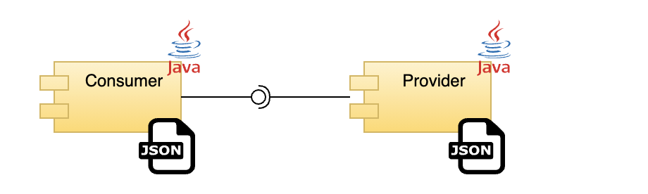
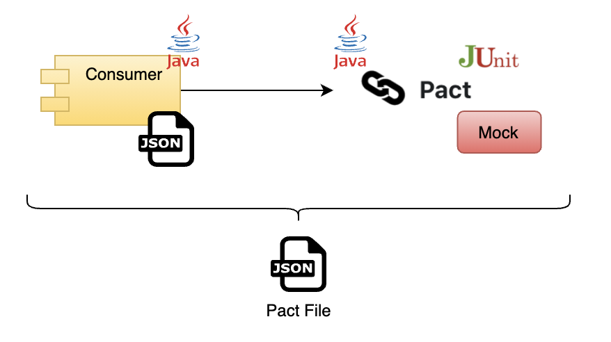
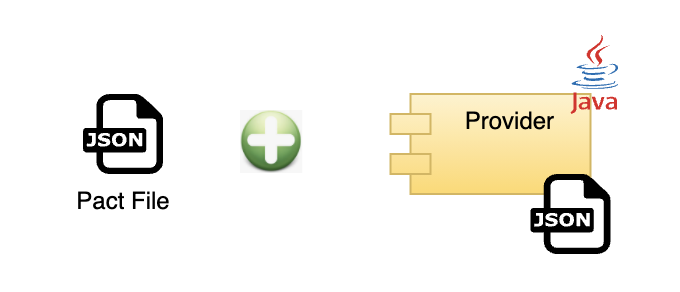

# Contract Testing usando PACT

# Descripción de PACT
[PACT Site](https://https://docs.pact.io/)

- PACT es un framework que nos permite validar los contratos de un cliente y de un server que expone un servicio, este framework tiene características que permiten validar cuando un cambio cambio o cuando fue agregado o eliminado , permitiendo aplicar una estrategia de fail fast.

# Objetivo

- Este código intenta hacer una breve descripción de como se puede usar PACT con dos proyecto Cliente/Servidor, los dos componentes
Hacer uso de Java como lenguaje base, sin embargo, PACT soporta varios lenguajes de programación como 
por ejemplo: Java, Python, Go, JS

 
# Detalle de Consumer

 - Este proyecto contiene la configuración necesaria para correr una prueba con PACT y generar el archivo Pact.json 
 el cual contiene las interacciones. Este archivo es el que se colocará en el provider, se usando una tarea automática, manual o usando el Pact Broker.
 
# Detalle de Consumer

- Este proyecto contiene el código para exponer un endpoint el cual sera consumido por el provider, con el objetivo de validar las interaciones presentes en el
pact.json, se crea el folder denominado **pacts** el cual ya contiene el archivo json que sera evaluado al ejecutar la tarea de gradle **./gradlew pactVerify**

 